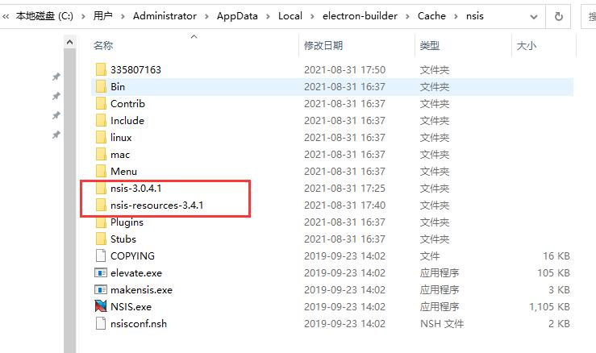
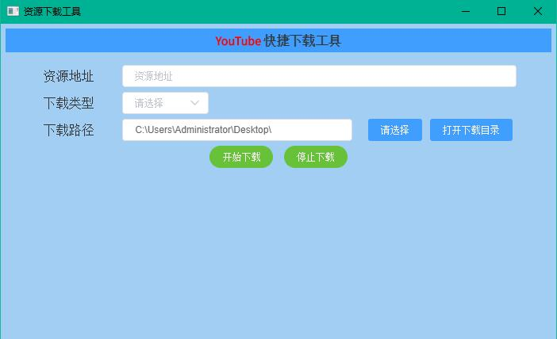

# youtube-dl-GUI
一款简便操作的下载工具。方便自己平时使用。
# 环境 
* **Node 14.17.5**
* **npm 6.14.14**

# 运行
* **1.npm install**
* **2.npm run dev**

# Windows下的构建
## 一：打包成文件夹及绿色免安装
* **1.npm run build:clean**
* **2.npm run build:dir**

注意：

build过程中，若winCodeSign依赖包无法下载导致构建失败。解决方法如下：
* 1.打开链接: https://github.com/electron-userland/electron-builder-binaries/releases
* 2.选择对应版本的Source code (zip)下载并解压，里面已经包含nsis
* 3.windows系统下，在%LOCALAPPDATA%（C:\Users\Administrator\AppData\Local）目录下新建electron-builder\cache\ 文件夹
* 4.将第二步Source code (zip)解压后的所有文件，拷贝至cache目录下
* 5.将/cache/winCodeSign文件夹拷贝一份，再放入/cache/winCodeSign目录内，
    并将winCodeSign文件夹名称修改为对应版本的名称（例如：winCodeSign-2.6.0）
* 6.至此，npm run build:dir 应该可以了。

## 二：打包成exe的安装包
* **1.npm run build:clean**
* **2.npm run build**

注意：

build过程中，若nsis、nsis-resources等依赖包无法下载导致构建失败。解决方法如下：
* 1.根据报错失败的两个下载链接，手动进行下载解压，
  并替换至C:\Users\Administrator\AppData\Local\electron-builder\cache下，具体操作如下：

  (1)将下载后的nsis-3.0.4.1文件夹放入/cache/nsis文件夹下
  
  (2)将下载后的nsis-resources-3.4.1文件夹放入/cache/nsis文件夹下
* 2.不能更改下载后的两个文件夹名称，文件夹名称必须和报错中提到的文件名称一致。若不一致，请手动修改一致。
* 3.最终目录结构如下：至此，应该可以build成功了。

# Node版本引起的常见问题
[解决方法](https://github.com/SimulatedGREG/electron-vue/issues/871)

# 界面预览

